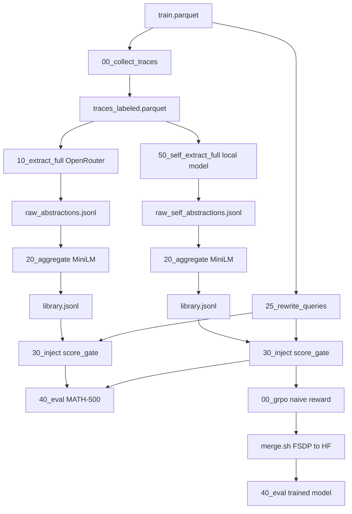

# "Notes to Self: Can LLMs Benefit from Experiential Abstractions?

Pipeline for building a retrieval library of math reasoning abstractions from model traces, injecting them at test time, and optionally fine-tuning with GRPO. All commands run from `verl/`.

Default stack: **MiniLM** embeddings (`sentence-transformers/all-MiniLM-L6-v2`), query rewrite via the base model, and **score-gated** injection (`RETRIEVAL_MODE=score_gate`, `GATE_MARGIN=0.02`).

## Environment

```bash
git clone https://github.com/moment-timeseries-foundation-model/Test-Time-Training.git

cd Test-Time-Training/verl

conda create -n verl python==3.12
conda activate verl
USE_MEGATRON=0 bash scripts/install_vllm_sglang_mcore.sh
pip install -U "numpy==2.2.0"  # resolve conflicts with Numba
pip install --no-deps -e .
```

Set `OPENROUTER_API_KEY` for teacher abstraction extraction (`10_extract_full.sh`) and abstraction-use judging (`judge_abstraction_use.sh`). Self-extraction, eval, and GRPO run locally on GPU only.

## Datasets

To prepare the training dataset, run:

```bash
python -m examples.data_preprocess.math_dataset_ttt --local_save_dir ~/data/math --data_source DigitalLearningGmbH/MATH-lighteval
```

To prepare MATH-500 for evaluation, run:

```bash
python -m examples.data_preprocess.math_dataset_ttt --local_save_dir ~/data/MATH-500 --data_source HuggingFaceH4/MATH-500
```

The `parquet` files will be generated under `~/data/`.

## Pipeline overview




## Common setup

```bash
cd verl
conda activate verl

# common exports
export MODEL_FAMILY="meta-llama" #"Qwen"
export MODEL_NAME="Llama-3.2-3B-Instruct" #"Qwen2.5-1.5B-Instruct" 
export MODEL_PATH="$MODEL_FAMILY/$MODEL_NAME"
export TRACE_ROOT="/raid/$USER/traces/$MODEL_NAME"
export EVAL_ROOT="/raid/$USER/eval/abs/$MODEL_NAME"
export CHECKPOINT_ROOT="/raid/$USER/checkpoints/$MODEL_NAME"
export TRAIN_PATH="$HOME/data/math/train.parquet"
export TEST_PATH="$HOME/data/MATH-500/test.parquet"
```

GPU knobs used by most scripts: `CUDA_VISIBLE_DEVICES`, `NUM_GPUS`, `GPU_MEM`, `MICRO_BSZ`.

---

## Main workflow — teacher extraction (OpenRouter)

### Step -1.0: evaluate base model

```bash
MODEL_PATH="$MODEL_PATH" \
OUT_DIR="$EVAL_ROOT/base-model/" \
CUDA_VISIBLE_DEVICES="0,1,2,4" \
NUM_GPUS=4 \
GPU_MEM=0.8 \
MICRO_BSZ=2 \
bash examples/hrlib/40_eval.sh
```

### Step -1.1: train and evaluate with GRPO

```bash
TRAIN_DATA_PATH="$HOME/data/math/train.parquet" \
MODEL_PATH="$MODEL_PATH" \
OUT_DIR="$CHECKPOINT_ROOT/grpo" \
CUDA_VISIBLE_DEVICES="0,1,2,4" \
NUM_GPUS=4 \
GPU_MEM=0.8 \
MICRO_BSZ=2 \
bash examples/hrlib/00_grpo.sh

LOCAL_DIR="$CHECKPOINT_ROOT/grpo/global_step_58/actor" \
bash examples/test_time_training/merge.sh

MODEL_PATH="$CHECKPOINT_ROOT/grpo/global_step_58/merged_hf_model" \
OUT_DIR="$EVAL_ROOT/grpo/" \
CUDA_VISIBLE_DEVICES="0,1" \
NUM_GPUS=2 \
GPU_MEM=0.8 \
MICRO_BSZ=1 \
bash examples/hrlib/40_eval.sh
```

### Step 0: collect traces

```bash
MODEL_PATH="$MODEL_PATH" \
DATA_PATH="$TRAIN_PATH" \
OUT_DIR="$TRACE_ROOT/round0" \
CUDA_VISIBLE_DEVICES="0,1,2,4" \
NUM_GPUS=4 \
GPU_MEM=0.8 \
MICRO_BSZ=2 \
bash examples/hrlib/00_collect_traces.sh
```

### Step 1: extract abstractions

```bash
export OPENROUTER_API_KEY=...

LABELED_PARQUET="$TRACE_ROOT/round0/traces_labeled.parquet" \
OUT_DIR="$TRACE_ROOT/round0" \
MODEL="deepseek/deepseek-v4-flash" \
FALLBACK_MODEL="deepseek/deepseek-v4-flash" \
MAX_CONCURRENCY="40" \
bash examples/hrlib/10_extract_full.sh
```

### Step 2: build MiniLM library

```bash
RAW_JSONL="$TRACE_ROOT/round0/raw_abstractions.jsonl" \
EMBEDDER="sentence-transformers/all-MiniLM-L6-v2" \
bash examples/hrlib/20_aggregate.sh
```

### Step 2.1: generate rewritten query parquet

```bash
OUT_DIR="$TRACE_ROOT/rewrite_gen" \
IN_PARQUET="$TEST_PATH" \
OUT_PARQUET="$HOME/data/MATH-500/$MODEL_NAME/test_rewritten.parquet" \
DATA_TRAIN="$TRAIN_PATH" \
MODEL_PATH="$MODEL_PATH" \
CUDA_VISIBLE_DEVICES="0,1,2,4" \
NUM_GPUS=4 \
GPU_MEM=0.8 \
MICRO_BSZ=2 \
bash examples/hrlib/25_rewrite_queries.sh
```

### Step 3: inject abstractions

#### Original query

```bash
LIBRARY_DIR="/$TRACE_ROOT/round0" \
IN_PARQUET="$TEST_PATH" \
OUT_PARQUET="$HOME/data/MATH-500/$MODEL_NAME/test_abstraction_orig.parquet" \
QUERY_RECIPE="[{subject}] {user_text}" \
DUMP_SCORES=1 \
RETRIEVAL_MODE=orig \
bash examples/hrlib/30_inject.sh
```

#### Rewritten query

```bash
LIBRARY_DIR="/$TRACE_ROOT/round0" \
IN_PARQUET="$TEST_PATH" \
OUT_PARQUET="$HOME/data/MATH-500/$MODEL_NAME/test_abstraction_rewrite.parquet" \
QUERY_PARQUET="$HOME/data/MATH-500/$MODEL_NAME/test_rewritten.parquet" \
QUERY_RECIPE="[{subject}] {user_text}" \
DUMP_SCORES=1 \
RETRIEVAL_MODE=rewrite \
bash examples/hrlib/30_inject.sh
```

#### Gated retrieval

```bash
LIBRARY_DIR="/$TRACE_ROOT/round0" \
IN_PARQUET="$TEST_PATH" \
OUT_PARQUET="$HOME/data/MATH-500/$MODEL_NAME/test_abstraction_gated.parquet" \
QUERY_PARQUET="$HOME/data/MATH-500/$MODEL_NAME/test_rewritten.parquet" \
QUERY_RECIPE="[{subject}] {user_text}" \
DUMP_SCORES=1 \
RETRIEVAL_MODE=score_gate \
GATE_METRIC=top1 \
GATE_MARGIN=0.02 \
GATE_TIE_POLICY=prefer_original \
bash examples/hrlib/30_inject.sh
```

#### Evaluation of retrieval stats

```bash
python examples/hrlib/score_gate_diagnostics.py \
  --scores "$HOME/data/MATH-500/$MODEL_NAME/meta/test_abstraction_gated_scores.jsonl"
```

### Step 4: evaluate

```bash
DATA_VAL="$HOME/data/MATH-500/$MODEL_NAME/test_abstraction_gated.parquet" \
MODEL_PATH="$MODEL_PATH" \
OUT_DIR="$EVAL_ROOT/base-model-inject-gated/" \
CUDA_VISIBLE_DEVICES="0,1,2,4" \
NUM_GPUS=4 \
GPU_MEM=0.8 \
MICRO_BSZ=2 \
bash examples/hrlib/40_eval.sh
```

### Step 5: compare

```bash
python3 examples/hrlib/evaluate_results.py lift -- \
--baseline "$EVAL_ROOT/base-model/0.jsonl" \
--treated "$EVAL_ROOT/base-model-inject-gated/0.jsonl"

python3 examples/hrlib/evaluate_results.py lift -- \
--baseline "$EVAL_ROOT/base-model/0.jsonl" \
--treated "$EVAL_ROOT/grpo/0.jsonl"
```

### Step 6: inject abstractions into math train set

#### Query rewrite

```bash
OUT_DIR="$TRACE_ROOT/rewrite_gen_train" \
IN_PARQUET="$TRAIN_PATH" \
OUT_PARQUET="$HOME/data/math/$MODEL_NAME/train_rewritten.parquet" \
DATA_TRAIN="$TRAIN_PATH" \
MODEL_PATH="$MODEL_PATH" \
CUDA_VISIBLE_DEVICES="0,1,2,4" \
NUM_GPUS=4 \
GPU_MEM=0.8 \
MICRO_BSZ=2 \
bash examples/hrlib/25_rewrite_queries.sh
```

#### Gated retrieval

```bash
LIBRARY_DIR="/$TRACE_ROOT/round0" \
IN_PARQUET="$TRAIN_PATH" \
OUT_PARQUET="$HOME/data/math/$MODEL_NAME/train_abstraction_gated.parquet" \
QUERY_PARQUET="$HOME/data/math/$MODEL_NAME/train_rewritten.parquet" \
QUERY_RECIPE="[{subject}] {user_text}" \
DUMP_SCORES=1 \
RETRIEVAL_MODE=score_gate \
GATE_METRIC=top1 \
GATE_MARGIN=0.02 \
GATE_TIE_POLICY=prefer_original \
bash examples/hrlib/30_inject.sh
```

### Step 7: train and evaluate with GRPO on injected prompts

```bash
TRAIN_DATA_PATH="$HOME/data/math/$MODEL_NAME/train_abstraction_gated.parquet" \
MODEL_PATH="$MODEL_PATH" \
OUT_DIR="$CHECKPOINT_ROOT/grpo-injected" \
CUDA_VISIBLE_DEVICES="0,1,2,4" \
NUM_GPUS=4 \
GPU_MEM=0.8 \
MICRO_BSZ=2 \
bash examples/hrlib/00_grpo.sh

LOCAL_DIR="$CHECKPOINT_ROOT/grpo-injected/global_step_58/actor" \
bash examples/test_time_training/merge.sh

MODEL_PATH="$CHECKPOINT_ROOT/grpo-injected/global_step_58/merged_hf_model" \
OUT_DIR="$EVAL_ROOT/grpo-injected/" \
CUDA_VISIBLE_DEVICES="2,4" \
NUM_GPUS=2 \
GPU_MEM=0.8 \
MICRO_BSZ=1 \
bash examples/hrlib/40_eval.sh

DATA_VAL="$HOME/data/MATH-500/$MODEL_NAME/test_abstraction_gated.parquet" \
MODEL_PATH="$CHECKPOINT_ROOT/grpo-injected/global_step_58/merged_hf_model" \
OUT_DIR="$EVAL_ROOT/grpo-injected-inject-gated/" \
CUDA_VISIBLE_DEVICES="0,1,2,4" \
NUM_GPUS=4 \
GPU_MEM=0.8 \
MICRO_BSZ=2 \
bash examples/hrlib/40_eval.sh
```

### Step 7.5: use Qwen3-1.7B-Base's abstractions

#### Training

```bash
TRAIN_DATA_PATH="$HOME/data/math/Qwen3-1.7B-Base/train_abstraction_re_gated.parquet" \
MODEL_PATH="$MODEL_PATH" \
OUT_DIR="$CHECKPOINT_ROOT/grpo-qwen" \
CUDA_VISIBLE_DEVICES="0,1,2,4" \
NUM_GPUS=4 \
GPU_MEM=0.8 \
MICRO_BSZ=2 \
bash examples/hrlib/00_grpo.sh

LOCAL_DIR="$CHECKPOINT_ROOT/grpo-qwen/global_step_58/actor" \
bash examples/test_time_training/merge.sh

MODEL_PATH="$CHECKPOINT_ROOT/grpo-qwen/global_step_58/merged_hf_model" \
OUT_DIR="$EVAL_ROOT/grpo-injected-qwen/" \
CUDA_VISIBLE_DEVICES="2,4" \
NUM_GPUS=2 \
GPU_MEM=0.8 \
MICRO_BSZ=1 \
bash examples/hrlib/40_eval.sh

DATA_VAL="$HOME/data/MATH-500/$MODEL_NAME/test_abstraction_gated.parquet" \
MODEL_PATH="$CHECKPOINT_ROOT/grpo-qwen/global_step_58/merged_hf_model" \
OUT_DIR="$EVAL_ROOT/grpo-injected-qwen-inject-gated/" \
CUDA_VISIBLE_DEVICES="0,1,2,4" \
NUM_GPUS=4 \
GPU_MEM=0.8 \
MICRO_BSZ=2 \
bash examples/hrlib/40_eval.sh
```

### Step 8: compare

```bash
python3 examples/hrlib/evaluate_results.py lift -- \
--baseline "$EVAL_ROOT/base-model/0.jsonl" \
--treated "$EVAL_ROOT/base-model-inject-gated/0.jsonl"

python3 examples/hrlib/evaluate_results.py lift -- \
--baseline "$EVAL_ROOT/grpo/0.jsonl" \
--treated "$EVAL_ROOT/grpo-injected/0.jsonl"

python3 examples/hrlib/evaluate_results.py lift -- \
--baseline "$EVAL_ROOT/base-model-inject-gated/0.jsonl" \
--treated "$EVAL_ROOT/grpo-injected-inject-gated/0.jsonl"
```

#### On Qwen abstractions

```bash
python3 examples/hrlib/evaluate_results.py lift -- \
--baseline "$EVAL_ROOT/grpo/0.jsonl" \
--treated "$EVAL_ROOT/grpo-qwen/0.jsonl"

python3 examples/hrlib/evaluate_results.py lift -- \
--baseline "$EVAL_ROOT/grpo-qwen/0.jsonl" \
--treated "$EVAL_ROOT/grpo-qwen-inject-gated/0.jsonl"
```

#### Cross eval (on prompts injected with Qwen)

```bash
python3 examples/hrlib/evaluate_results.py lift -- \
--baseline "$EVAL_ROOT/base-model/0.jsonl" \
--treated "$EVAL_ROOT/base-model-cross/0.jsonl"

python3 examples/hrlib/evaluate_results.py lift -- \
--baseline "$EVAL_ROOT/grpo-injected-inject-gated/0.jsonl" \
--treated "$EVAL_ROOT/grpo-injected-cross/0.jsonl"

python3 examples/hrlib/evaluate_results.py lift -- \
--baseline "$EVAL_ROOT/grpo-injected-inject-gated/0.jsonl" \
--treated "$EVAL_ROOT/grpo-qwen-cross/0.jsonl"
```

### Judge abstraction use

```bash
MODEL="deepseek/deepseek-v4-flash" \
FALLBACK_MODEL="deepseek/deepseek-v4-flash" \
VAL_JSONL="$EVAL_ROOT/base-model-inject-gated/0.jsonl" \
OUT_DIR="$EVAL_ROOT/base-model-inject-gated/judge-abs-use" \
bash examples/hrlib/judge_abstraction_use.sh

python examples/hrlib/evaluate_results.py judge-summary -- \
  "$EVAL_ROOT/base-model-inject-gated/judge-abs-use/judge_results.jsonl"

python examples/hrlib/evaluate_results.py judge-summary -- \
  "$EVAL_ROOT/grpo-injected-inject-gated/judge-abs-use/judge_results.jsonl"
```

Edit `global_step_58` in merge commands to match your checkpoint step.

---

## Self extraction — base model extracts its own abstractions

What if we use the base model itself to extract abstractions?

### Collect traces

```bash
MODEL_PATH="$MODEL_PATH" \
DATA_PATH="$TRAIN_PATH" \
OUT_DIR="$TRACE_ROOT/round0" \
CUDA_VISIBLE_DEVICES="0,1,2,4" \
NUM_GPUS=4 \
GPU_MEM=0.8 \
MICRO_BSZ=2 \
bash examples/hrlib/00_collect_traces.sh
```

### Self-extract abstractions

```bash
LABELED_PARQUET="$TRACE_ROOT/round0/traces_labeled.parquet" \
DATA_TRAIN="$HOME/data/math/train.parquet" \
MODEL_PATH="$MODEL_PATH" \
CUDA_VISIBLE_DEVICES="0,1,2,4" \
NUM_GPUS=4 \
GPU_MEM=0.8 \
MICRO_BSZ=2 \
bash examples/hrlib/50_self_extract_full.sh
```

### Build MiniLM library

```bash
RAW_JSONL="$TRACE_ROOT/round0/raw_self_abstractions.jsonl" \
OUT_DIR="$TRACE_ROOT/round0/self" \
EMBEDDER="sentence-transformers/all-MiniLM-L6-v2" \
bash examples/hrlib/20_aggregate.sh
```

### Rewrite train and test

```bash
OUT_DIR="$TRACE_ROOT/rewrite_gen_train" \
IN_PARQUET="$TRAIN_PATH" \
OUT_PARQUET="$HOME/data/math/$MODEL_NAME/train_rewritten.parquet" \
DATA_TRAIN="$TRAIN_PATH" \
MODEL_PATH="$MODEL_PATH" \
CUDA_VISIBLE_DEVICES="0,1,2,4" \
NUM_GPUS=4 \
GPU_MEM=0.8 \
MICRO_BSZ=2 \
bash examples/hrlib/25_rewrite_queries.sh

OUT_DIR="$TRACE_ROOT/rewrite_gen" \
IN_PARQUET="$TEST_PATH" \
OUT_PARQUET="$HOME/data/MATH-500/$MODEL_NAME/test_rewritten.parquet" \
DATA_TRAIN="$TRAIN_PATH" \
MODEL_PATH="$MODEL_PATH" \
CUDA_VISIBLE_DEVICES="0,1,2,4" \
NUM_GPUS=4 \
GPU_MEM=0.8 \
MICRO_BSZ=2 \
bash examples/hrlib/25_rewrite_queries.sh
```

### Gated inject on test

```bash
LIBRARY_DIR="/$TRACE_ROOT/round0/self" \
IN_PARQUET="$TEST_PATH" \
OUT_PARQUET="$HOME/data/MATH-500/$MODEL_NAME/test_self_abstraction_gated.parquet" \
QUERY_PARQUET="$HOME/data/MATH-500/$MODEL_NAME/test_rewritten.parquet" \
QUERY_RECIPE="[{subject}] {user_text}" \
DUMP_SCORES=1 \
RETRIEVAL_MODE=score_gate \
GATE_METRIC=top1 \
GATE_MARGIN=0.02 \
GATE_TIE_POLICY=prefer_original \
bash examples/hrlib/30_inject.sh
```

### Gated inject on train

```bash
LIBRARY_DIR="/$TRACE_ROOT/round0/self" \
IN_PARQUET="$TRAIN_PATH" \
OUT_PARQUET="$HOME/data/math/$MODEL_NAME/train_self_abstraction_gated.parquet" \
QUERY_PARQUET="$HOME/data/math/$MODEL_NAME/train_rewritten.parquet" \
QUERY_RECIPE="[{subject}] {user_text}" \
DUMP_SCORES=1 \
RETRIEVAL_MODE=score_gate \
GATE_METRIC=top1 \
GATE_MARGIN=0.02 \
GATE_TIE_POLICY=prefer_original \
bash examples/hrlib/30_inject.sh
```

### Eval base

```bash
DATA_VAL="$HOME/data/MATH-500/$MODEL_NAME/test_self_abstraction_gated.parquet" \
MODEL_PATH="$MODEL_PATH" \
OUT_DIR="$EVAL_ROOT/base-model-inject-self-gated/" \
CUDA_VISIBLE_DEVICES="0,1,2,4" \
NUM_GPUS=4 \
GPU_MEM=0.8 \
MICRO_BSZ=2 \
bash examples/hrlib/40_eval.sh
```

### Train GRPO on injected prompts

```bash
TRAIN_DATA_PATH="$HOME/data/math/$MODEL_NAME/train_self_abstraction_gated.parquet" \
MODEL_PATH="$MODEL_PATH" \
OUT_DIR="$CHECKPOINT_ROOT/grpo-self-injected" \
CUDA_VISIBLE_DEVICES="0,1,2,4" \
NUM_GPUS=4 \
GPU_MEM=0.8 \
MICRO_BSZ=2 \
bash examples/hrlib/00_grpo.sh

LOCAL_DIR="$CHECKPOINT_ROOT/grpo-self-injected/global_step_58/actor" \
bash examples/test_time_training/merge.sh

MODEL_PATH="$CHECKPOINT_ROOT/grpo-self-injected/global_step_58/merged_hf_model" \
OUT_DIR="$EVAL_ROOT/grpo-self-injected/" \
CUDA_VISIBLE_DEVICES="0,1,2,4" \
NUM_GPUS=4 \
GPU_MEM=0.8 \
MICRO_BSZ=2 \
bash examples/hrlib/40_eval.sh

DATA_VAL="$HOME/data/MATH-500/$MODEL_NAME/test_self_abstraction_gated.parquet" \
MODEL_PATH="$CHECKPOINT_ROOT/grpo-self-injected/global_step_58/merged_hf_model" \
OUT_DIR="$EVAL_ROOT/grpo-self-injected-inject-gated/" \
CUDA_VISIBLE_DEVICES="0,1,2,4" \
NUM_GPUS=4 \
GPU_MEM=0.8 \
MICRO_BSZ=2 \
bash examples/hrlib/40_eval.sh
```

### Compare with teacher extraction

```bash
python3 examples/hrlib/evaluate_results.py lift -- \
--baseline "$EVAL_ROOT/base-model/0.jsonl" \
--treated "$EVAL_ROOT/grpo/0.jsonl"

python3 examples/hrlib/evaluate_results.py lift -- \
--baseline "$EVAL_ROOT/base-model-inject-gated/0.jsonl" \
--treated "$EVAL_ROOT/base-model-inject-self-gated/0.jsonl"

python3 examples/hrlib/evaluate_results.py lift -- \
--baseline "$EVAL_ROOT/grpo-injected/0.jsonl" \
--treated "$EVAL_ROOT/grpo-self-injected/0.jsonl"

python3 examples/hrlib/evaluate_results.py lift -- \
--baseline "$EVAL_ROOT/grpo-injected-inject-gated/0.jsonl" \
--treated "$EVAL_ROOT/grpo-self-injected-inject-gated/0.jsonl"
```

### Judge abstraction use

```bash
MODEL="deepseek/deepseek-v4-flash" \
FALLBACK_MODEL="deepseek/deepseek-v4-flash" \
VAL_JSONL="$EVAL_ROOT/base-model-inject-gated/0.jsonl" \
OUT_DIR="$EVAL_ROOT/base-model-inject-gated/judge-abs-use" \
bash examples/hrlib/judge_abstraction_use.sh
```

