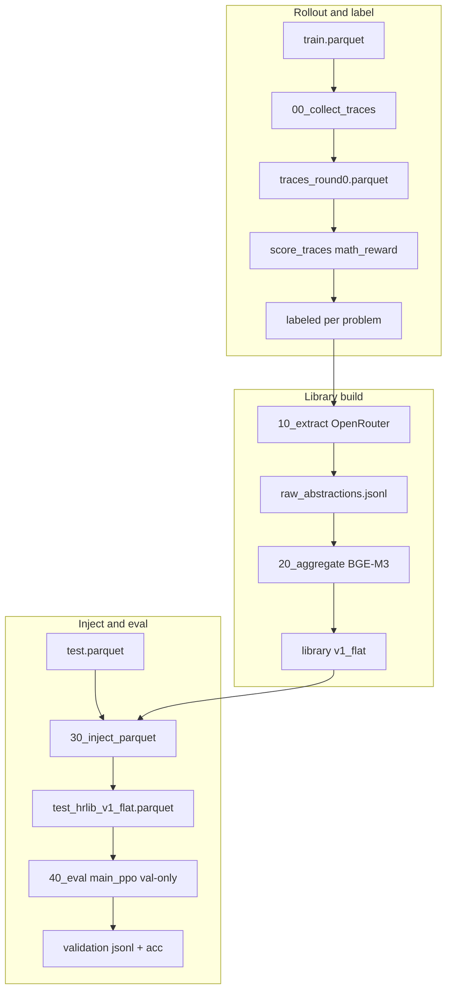
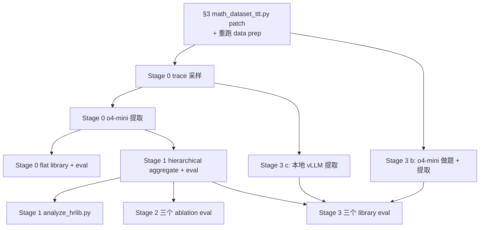

# Implementation Plan — Stage 0–3 (Inference-time Library)

本文是 [research_proposal.md](research_proposal.md) 的工程执行手册，覆盖范围为 **Stage 0–3**：从 trace 收集到 hierarchical retrieval 的全部 inference-time 实验，**不涉及任何 RL 训练**。预计 3–4 周完成；任意一个 stage 停下来都已经构成可发表的子结论（参见 proposal §6 checkpoint）。

> **Changelog**：本文取代并删除已有的 `implementation_guide.md`（parquet schema 写错；未挂到现有 `examples/test_time_training/` 资产）和 `coding_plan.md`（信息已被吸收并化简）。Stage 4–7 的执行骨架见 [implementation_plan_stage_4-7.md](implementation_plan_stage_4-7.md)。

---

## §1 Asset Map：可直接复用的 verl 资产

Stage 0–3 的 99% 工作是把现有 verl 组件串起来；下表列出每个能力对应的现成文件。


| 能力                                                               | 现成文件                                                                                                                                                                                                                                                                                         | 复用方式                                                     |
| ---------------------------------------------------------------- | -------------------------------------------------------------------------------------------------------------------------------------------------------------------------------------------------------------------------------------------------------------------------------------------- | -------------------------------------------------------- |
| Batch trace 采样（每题 N 条）                                           | [verl/verl/trainer/main_generation.py](verl/verl/trainer/main_generation.py) + [verl/verl/trainer/config/generation.yaml](verl/verl/trainer/config/generation.yaml)                                                                                                                          | 直接调用，传 `data.path` / `data.n_samples` / `model.path`     |
| Ray-isolation 模板（多 GPU、可并发）                                      | [verl/examples/test_time_training/train_ttrl.sh](verl/examples/test_time_training/train_ttrl.sh) 第 22–66 行                                                                                                                                                                                   | 整段拷贝到新的 wrapper 脚本里                                      |
| Parquet schema（prompt / reward_model / data_source / extra_info） | [verl/examples/data_preprocess/math_dataset_ttt.py](verl/examples/data_preprocess/math_dataset_ttt.py) 第 70–80 行                                                                                                                                                                             | 作为 schema 权威；只做 §3 的微 patch                              |
| 答案抽取与判分（成功/失败标签）                                                 | [verl/verl/utils/reward_score/math_reward.py](verl/verl/utils/reward_score/math_reward.py)（`compute_score` / `last_boxed_only_string` / `remove_boxed`） [verl/verl/utils/reward_score/auto_extract.py](verl/verl/utils/reward_score/auto_extract.py)（`extract_answer` / `get_source_family`） | 直接 import；和训练时同一套打分函数                                    |
| Source family 路由                                                 | [verl/verl/utils/reward_score/auto_extract.py](verl/verl/utils/reward_score/auto_extract.py) 第 8–27、42–55 行 `_MATH_REWARD_SOURCES` / `get_source_family`                                                                                                                                     | injection 后 `data_source` 不要改，否则 reward 路由会断             |
| 评测 entry point                                                   | [verl/examples/test_time_training/evaluate_intuitor.sh](verl/examples/test_time_training/evaluate_intuitor.sh)                                                                                                                                                                               | 复制为 `40_eval.sh`，把 `data.val_files` 指向 augmented parquet |
| FSDP→HF 检查点合并（如果用 SFT/RL ckpt 评测）                                | [verl/scripts/legacy_model_merger.py](verl/scripts/legacy_model_merger.py) 经 [verl/examples/test_time_training/merge.sh](verl/examples/test_time_training/merge.sh) 封装                                                                                                                       | Stage 0–3 评测 base 或已 merge 的 HF model 时不需要               |
| Per-prompt accuracy / pass@k 分析                                  | [verl/scripts/analyze.py](verl/scripts/analyze.py)                                                                                                                                                                                                                                           | 直接 import，新分析脚本作为 sibling                                |
| MATH 数据预处理                                                       | [verl/examples/data_preprocess/math_dataset_ttt.py](verl/examples/data_preprocess/math_dataset_ttt.py)                                                                                                                                                                                       | 作为 patch 起点（§3）                                          |


---

## §2 New Code Layout

新代码集中在两个目录，遵循 verl 既有约定（`verl/verl/<package>` + `verl/examples/<task>`）。

```
verl/verl/hrlib/                        # hierarchical reasoning library 核心包
├── __init__.py
├── schema.py                           # @dataclass Abstraction + JSONL IO
├── extract.py                          # 调 LLM 逐题提取 strategy/caution
├── aggregate.py                        # embedding 去重 + level 分配 + FAISS
├── retrieve.py                         # FAISS 加载 + flat / hierarchical retrieve
└── inject.py                           # parquet → parquet：把 retrieved 拼进 prompt[0]

verl/examples/hrlib/
├── 00_collect_traces.sh                # wrapper of main_generation.py + Ray block
├── 10_extract.py                       # CLI over hrlib/extract.py
├── 20_aggregate.py                     # CLI over hrlib/aggregate.py
├── 30_inject_parquet.py                # CLI over hrlib/inject.py
├── 40_eval.sh                          # wrapper of main_ppo with total_epochs=0
└── README.md                           # 5 行执行序列 + 当前 library 版本指针

verl/scripts/analyze_hrlib.py           # sibling of analyze.py：层级 / source / strategy-caution 统计
```

化简掉的两个模块（`coding_plan.md` 原本规划的）：

- `**domain_router.py**` — Stage 1 直接读 `extra_info["subject"]`（HF MATH 自带），不需要 LLM 分类器。详见 §3 patch 与 §6。
- `**io.py**` — 合并进 `schema.py`，`Abstraction.to_jsonl` / `from_jsonl` 三五行就够。

---

## §3 One-time Prerequisites

### 3.1 Python 依赖

Stage 0–3 需要的新包分成「必装」和「可选」两层，全部遵守 [CLAUDE.md](CLAUDE.md) 的约束：**一律用 `--no-deps` 安装**，避免触发 vLLM/SGLang/FlashAttention 的重解析。

**必装（Stage 0 v1 最小集）**：

```bash
pip install --no-deps "openai>=1.40"                 # OpenAI-compatible HTTP（OpenRouter / 自建 vLLM）
pip install --no-deps "rapidfuzz>=3.9"               # §5.2.3 文本层快速去重（token_set_ratio）
pip install --no-deps "sentence-transformers>=3.0"   # §5.2.3 可选语义去重 + §5.2.4 检索必需的 embedding
# 若 sentence-transformers 抱怨 tokenizers / huggingface_hub 版本再单独补：
# pip install --no-deps "huggingface_hub>=0.24" "tokenizers>=0.19"
```

**可选（可以等规模变大再装）**：

```bash
pip install --no-deps "faiss-cpu>=1.8"     # 库条目 > ~20k 时再启用；v1 用 numpy 点积即可
pip install --no-deps "scikit-learn>=1.5"  # 层级聚类/分析类需要时再装；v1 用 union-find
```

默认嵌入模型从 **`sentence-transformers/all-MiniLM-L6-v2`**（80MB、CPU 几秒级）起步；Stage 1+ 若准确率瓶颈明显再切 `BAAI/bge-m3`——两者只差一行 `--embed_model`。

### 3.1.1 OpenRouter（免费/低价模型，例如 GPT-OSS-120B）

Stage 0–2 的 **abstraction 提取**默认改为通过 [OpenRouter](https://openrouter.ai/) 调用大模型，而**不**依赖 OpenAI 直连的 `o4-mini`。OpenRouter 提供 OpenAI-compatible 的 `/v1/chat/completions` 接口，`openai` Python SDK 只需改 `base_url` 与 API key。

**环境变量（示例）**：

```bash
export OPENROUTER_API_KEY="sk-or-..."   # 在 OpenRouter 账户里创建
# 可选：OpenRouter 建议在请求里带站点信息（部分免费额度/统计会用到）
export OPENROUTER_HTTP_REFERER="https://github.com/your-org/Test-Time-Training"
export OPENROUTER_APP_TITLE="hrlib-extract"
```

`**10_extract.py` / `hrlib/extract.py` 侧约定**（实现时按此对齐）：

- `base_url=https://openrouter.ai/api/v1`
- `api_key=os.environ["OPENROUTER_API_KEY"]`
- 可选：在 `default_headers` 里设置 `HTTP-Referer`、`X-Title`（与 OpenRouter 文档一致）
- `--model` 传 **OpenRouter 控制台里显示的完整 model id**（会随上架/免费档变化；例如当前常用的开源权重可能是 `openai/gpt-oss-120b` 一类命名——**以 [openrouter.ai/models](https://openrouter.ai/models) 为准**，不要硬编码过期 id）

**与 o4-mini 方案的差异（写进实验记录）**：

- **成本**：免费档 / 低价档可显著降低 Stage 0–2 与 Stage 3「大模型分析」的预算；具体以 OpenRouter 定价与 rate limit 为准。
- **稳定性**：免费模型可能有 **RPM/TPM、排队、突降配额**；`10_extract` 应保留 `resume` + 退避重试 + 可调低 `max_concurrency`。
- **质量**：不同模型提取的 abstraction 质量可能不同；Stage 0 deliverables 里应记录 **model id + OpenRouter 快照日期**。

### 3.2 `math_dataset_ttt.py` 微 patch

HF MATH 原始字段含 `level`（"Level 1"–"Level 5"）和 `type`（subject 名，如 "Algebra"），现在 `math_dataset_ttt.py` 把它们丢掉了。Stage 1 的涌现 hierarchy 依赖 `subject`，Stage 1/3 的 easy-to-hard 分析依赖 `level`。最小 patch：

**Before** —— [verl/examples/data_preprocess/math_dataset_ttt.py](verl/examples/data_preprocess/math_dataset_ttt.py) 第 64–80 行：

```python
def make_map_fn(split):
    def process_fn(example, idx):
        question = example.pop("problem")
        answer = example.pop("solution")
        solution = extract_solution(answer)

        data = {
            "data_source": data_source,
            "prompt": [
                {"role": "system", "content": instruction_following},
                {"role": "user", "content": question},
            ],
            "ability": "math",
            "reward_model": {"style": "rule", "ground_truth": solution},
            "extra_info": {"split": split, "index": idx},
        }
        return data
    return process_fn
```

**After**：

```python
def make_map_fn(split):
    def process_fn(example, idx):
        question = example.pop("problem")
        answer = example.pop("solution")
        solution = extract_solution(answer)
        # HF MATH 自带 type (subject) 和 level；用于 hrlib 涌现 hierarchy 与 easy-to-hard 分析
        subject = example.get("type", "unknown")
        level = example.get("level", "unknown")

        data = {
            "data_source": data_source,
            "prompt": [
                {"role": "system", "content": instruction_following},
                {"role": "user", "content": question},
            ],
            "ability": "math",
            "reward_model": {"style": "rule", "ground_truth": solution},
            "extra_info": {
                "split": split,
                "index": idx,
                "subject": subject,
                "level": level,
            },
        }
        return data
    return process_fn
```

之后重跑数据准备：

```bash
cd verl
python -m examples.data_preprocess.math_dataset_ttt \
    --local_save_dir ~/data/math --data_source DigitalLearningGmbH/MATH-lighteval
python -m examples.data_preprocess.math_dataset_ttt \
    --local_save_dir ~/data/MATH-500 --data_source HuggingFaceH4/MATH-500
```

### 3.3 `data.max_prompt_length` 调整

注入 6 条 abstraction（每条 50–80 token，含 `when_to_apply`）后 prompt 大约 +600–900 token。现有训练/评测脚本里的 `data.max_prompt_length=512` 会直接被 `filter_overlong_prompts` 干掉。

**Stage 0–3 的策略**：用 `40_eval.sh` 时把 `data.max_prompt_length=1536`，与 [verl/verl/trainer/config/generation.yaml](verl/verl/trainer/config/generation.yaml) 第 27 行 `prompt_length: 1536` 对齐。在 wrapper 里硬编码即可，不动任何上游 yaml。

---

## §4 Data Interfaces 速查（消除常见误解）

四条 verl 特定的 fact，写代码前必须先认下：

1. `**prompt` 是 list-of-dict，不是 JSON string**。参见 [verl/examples/data_preprocess/math_dataset_ttt.py](verl/examples/data_preprocess/math_dataset_ttt.py) 第 72–75 行。Library injection 应通过 list 操作（prepend system message 或 in-place 改 `prompt[0]["content"]`）实现，**不要** `json.dumps`。
2. `**(data_source, extra_info["split"], extra_info["index"])` 是 canonical `problem_id`**。`index` 由 `dataset.map(..., with_indices=True)` 自动写入（同上文件第 96、101 行）。Library 内的 `source_problem_ids` 字段就用这个三元组的拼接字符串。
3. `**data_source` 决定打分器路由**。注入 abstraction 后 `data_source` 必须保持 `DigitalLearningGmbH/MATH-lighteval` / `HuggingFaceH4/MATH-500` 不变，否则 [verl/verl/utils/reward_score/auto_extract.py](verl/verl/utils/reward_score/auto_extract.py) 的 `get_source_family` 会找不到 `math_reward` 家族而 fallback 失败。
4. **Chat template 在 evaluate / generation 时由 verl 自己应用**。见 [verl/verl/trainer/main_generation.py](verl/verl/trainer/main_generation.py) 第 104–114 行 `tokenizer.apply_chat_template(...)`。Injection 阶段输出 raw chat list 即可，模型一侧的 special tokens 不用我们管。

---

## §5 Stage 0 — Flat Library, Inference Only

**Goal**：验证从小模型自身 trace 中提取的 abstraction，通过简单 retrieval 注入 prompt 就能提升 inference accuracy。

### 5.1 Pipeline




（上图路径与文件名细节见 §5.2；子图仅用于排版，避免横向 10+ 节点挤成一条细线。）

### 5.2 子组件

#### 5.2.1 Trace 采样（`00_collect_traces.sh`）


| 复用                                                                                 | 新增                                                                                                                                                |
| ---------------------------------------------------------------------------------- | ------------------------------------------------------------------------------------------------------------------------------------------------- |
| [verl/verl/trainer/main_generation.py](verl/verl/trainer/main_generation.py)（不改一行） | shell wrapper，整段套 [verl/examples/test_time_training/train_ttrl.sh](verl/examples/test_time_training/train_ttrl.sh) 第 22–66 行的 Ray-isolation block |


调用形式：

```bash
python3 -m verl.trainer.main_generation \
    data.path=$HOME/data/math/train.parquet \
    data.prompt_key=prompt \
    data.n_samples=8 \
    data.batch_size=128 \
    data.output_path=$OUTPUT_DIR/traces_round0.parquet \
    model.path=Qwen/Qwen3-1.7B-Base \
    rollout.temperature=0.8 \
    rollout.top_p=0.95 \
    rollout.prompt_length=512 \
    rollout.response_length=2048 \
    rollout.tensor_model_parallel_size=1 \
    rollout.gpu_memory_utilization=0.7 \
    trainer.n_gpus_per_node=$NUM_GPUS \
    trainer.nnodes=1
```

输出 parquet 含原始字段 + `responses: List[str]`（长度 = `n_samples`）。`hrlib/extract.py` 一开头有个 helper：

```python
def score_traces(parquet_path: str) -> List[dict]:
    """For each row × each response, compute math_reward.compute_score against ground_truth.
       Returns per-prompt {success_traces: [...], failure_traces: [...]} grouped by problem_id."""
```

复用 [verl/verl/utils/reward_score/math_reward.py](verl/verl/utils/reward_score/math_reward.py) 的 `compute_score`，与训练时完全一致。

#### 5.2.2 Extraction（`hrlib/extract.py` + `10_extract.py`）


| 复用                                                                             | 新增                                                                                                                                                                                                                                  |
| ------------------------------------------------------------------------------ | ----------------------------------------------------------------------------------------------------------------------------------------------------------------------------------------------------------------------------------- |
| `openai` SDK（`base_url=https://openrouter.ai/api/v1`）；`asyncio.Semaphore` 控制并发 | `Abstraction` 数据类、**一套英文 prompt 模板 + 成功/失败分支 instruction**、按 `problem_id` 做 resume 的 `done.jsonl` sidecar、`raw_llm_dumps.jsonl`（保存原始回复，便于后处理 / 人工清洗） |


当前实践假设与 Stage 0 原始设想不同，先明确下来：

- **每题只有 1 条 trace**（因为 `00_collect_traces.sh` 当前默认 `N_SAMPLES=1`）
- 已知该 trace 对应的 **ground-truth final answer** 与 **0/1 correctness label**
- **没有 reference solution**
- 成功题与失败题都要抽 abstraction：
  - **成功题**：提取 1–2 条“以后继续这样做”的 strategy / caution
  - **失败题**：提取 1–2 条“以后不要这样错 / 应该如何修正”的 caution / strategy

因此，`10_extract.py` 的最小输入单元改为：

```text
problem_text
ground_truth_answer
model_trace
is_correct   # score_traces.py 打出来的 0/1
```

输出改为 **每题最多 2 条** `Abstraction`，且每条 `principle` 必须是 **one sentence**：

```python
@dataclass
class Abstraction:
    name: str                # "check_coprimality"
    type: str                # "strategy" | "caution"
    principle: str           # exactly one sentence
    when_to_apply: str       # 使用条件
    domain: str              # 来自 LLM 自己的判断；Stage 1 会用 extra_info.subject 覆盖
    source_problem_id: str   # f"{data_source}|{split}|{index}"
    source_difficulty: str   # extra_info.level
    # aggregation 阶段填：
    level: Optional[str] = None        # general / domain / problem_specific
    hit_count: int = 1
    source_problem_ids: List[str] = field(default_factory=list)
```

### Prompt design（for `openai/gpt-oss-120b:free`, all-English）

这里不依赖 strict JSON schema；先让模型输出**一个很小的 JSON array**，解析失败就把原始回复保存在 `raw_llm_dumps.jsonl`，后续可人工整理 / 重试。原因是 OpenRouter free 模型的 schema-following 稳定性不一定和付费闭源模型一样，但我们仍然希望输出尽量结构化，降低人工清洗成本。

**System prompt**：

```text
You are extracting reusable mathematical reasoning abstractions from a model trace.

Your job is to read one math problem, the ground-truth final answer, one model-generated trace, and a correctness label telling you whether the trace is correct or incorrect.

Produce 1 or 2 reusable abstractions only. Each abstraction must be:
- a single sentence in "principle"
- generic and reusable across similar problems
- free of problem-specific numbers, variable names, answer values, or story details
- phrased as reasoning advice, not as a restatement of the solution

Allowed abstraction types:
- "strategy": a positive reasoning move that should be reused
- "caution": a mistake pattern or failure mode that should be avoided

Output a JSON array with 1 or 2 objects. Each object must contain exactly these keys:
- "name"
- "type"
- "principle"
- "when_to_apply"
- "domain"

Important rules:
- Do not copy phrases from the trace unless necessary.
- Do not mention the final answer explicitly.
- Do not mention concrete numbers unless they are universal constants like 0, 1, or pi.
- If the trace is correct, prefer strategy abstractions, but you may include one caution if the reasoning contains a risky pattern.
- If the trace is incorrect, prefer caution abstractions, but you may include one strategy if you can clearly infer a better reasoning move from the problem and the ground-truth answer.
- If there is only one strong abstraction, output only one.
```

**User prompt template**：

```text
Problem:
{problem_text}

Ground-truth final answer:
{ground_truth}

Model trace:
{trace_text}

Correctness label:
{correctness_label}

Task:
Extract 1 or 2 reusable one-sentence abstractions from this example.

Additional guidance:
{label_specific_guidance}

Return only a JSON array.
```

其中 `label_specific_guidance` 按 correctness label 分支：

- **if `is_correct == 1`**：

```text
This trace reached the correct final answer. Focus on the key reasoning move(s) worth reusing in future problems. Prefer strategy abstractions. You may include one caution only if the trace contains a potentially dangerous shortcut that happened to work here.
```

- **if `is_correct == 0`**：

```text
This trace did not reach the correct final answer. Focus on the main mistake pattern that should be avoided in future problems. Prefer caution abstractions. You may include one strategy only if a clearly better reasoning direction is recoverable from the problem and the ground-truth answer.
```

说明：

- 这是一套 **shared envelope + 成功/失败分支 instruction**，而不是两份完全独立 prompt；代码更简单，输出 schema 也保持一致。
- 由于**没有 reference solution**，失败题的 strategy 不要求“完整正确做法”，只要求能抽象出“更合理的下一步/判断方式”。
- 若 free 模型的 JSON 稳定性不够，可先保留当前 prompt，不开 strict schema，仅在 parser 端做：
  1. `json.loads` 直读  
  2. 提取 fenced JSON 再读  
  3. 失败则写入 `raw_llm_dumps.jsonl`，后续人工修或低并发重试

CLI：

```bash
python -m verl.examples.hrlib.10_extract \
    --traces $OUTPUT_DIR/traces_round0.parquet \
    --out    $OUTPUT_DIR/raw_abstractions.jsonl \
    --backend openrouter \
    --base_url https://openrouter.ai/api/v1 \
    --model  openai/gpt-oss-120b:free \
    --max_concurrency 8 \
    --resume_from $OUTPUT_DIR/raw_abstractions.jsonl \
    --raw_dump_out $OUTPUT_DIR/raw_llm_dumps.jsonl
```

建议的工程行为：

- `--max_concurrency` 从 **4–8** 起步；`openai/gpt-oss-120b:free` 若稳定再往上调
- 每题最多保留 **2 条 abstraction**；如果模型生成更多，parser 只取前 2 条
- 所有原始回复写入 `raw_llm_dumps.jsonl`：`{problem_id, is_correct, model, prompt_hash, raw_response, parsed_ok, timestamp}`
- `raw_abstractions.jsonl` 只保存成功 parse 的结构化结果；parse 失败的样本留在 raw dump，后续人工整理或单独重跑

#### 5.2.3 Aggregation（`hrlib/aggregate.py` + `20_aggregate.py`）

**原则**：§5.2.2 的 `raw_abstractions.jsonl` 里充斥着「措辞漂移」（same idea, rewording）和「换名式变体」（Cauchy-Schwarz / AM-GM / completing the square 的同义表达）。Aggregation 不是复杂的语义理解，而是把 ≈几千条原始 abstraction **压缩到几百条「经过清洗 + 去重」的库条目**，并保留 `hit_count` / `source_problem_ids` 以便后续统计与检索。

**v1 推荐管线**（默认 `method=semantic`，rapidfuzz 留作回退）：

```
raw_abstractions.jsonl
  │
  ▼  (1a) principle 规范化：小写、去首尾空白、合并多空白、去结尾标点
  ▼  (1b) domain 规范化：unicode dash → "-"、剥离 " - " / ":" / "/" / "," 之后的子域；小写 + 别名表
        （e.g., "Algebra – rational equations" → "algebra"，"Euclidean geometry" → "geometry"）
  ▼  (2) 过滤（v1 默认关闭，--filter true 才启用）：长度 15–240 字（normalized principle）；
        丢弃含数字 / 答案 / 题面专有名词的条目（leakage 启发式）
  ▼  (3) 按 type 分桶（strategy / caution 分开去重，避免跨类合并）
  ▼  (4) 聚类（method 派发器，三选一）：
         · semantic (默认)：sentence-transformers MiniLM 编码 Option B 模板字符串，cosine ≥ semantic_ratio (默认 0.88) 做 union-find
         · text          ：rapidfuzz.fuzz.token_set_ratio ≥ text_ratio (默认 80) 做 union-find（无 GPU / 无模型，回退路径）
         · two_tier      ：rapidfuzz 先聚 → 对每簇 medoid 编码 → cosine 二次合并（保守路线）
  ▼  (5) 代表选择：每簇选 medoid（簇内相似度行和最大），累加 hit_count、合并 source_problem_ids、
        汇总 canonical domain（多数票）+ 保留 raw domain 分布到 domains_seen_raw / cluster_members
  ▼  (6) 写 library.jsonl + library.md + meta.json + dropped.jsonl
        （semantic / two_tier 还会写 embeddings.npy + embeddings_meta.json，§5.2.4 检索时直接 mmap）
```

**为什么过滤默认关闭**：实测中 `gpt-oss-120b` 给出的 principle 经常是 1 句 150–200 字符的具体建议，硬性长度 + 关键词过滤会丢掉很多有价值的条目；v1 先全部纳入聚类，肉眼检查后再决定是否打开 `--filter`。`meta.json.filter_principles` 字段记录了本次运行是否启用过滤，便于 §6 deliverables 复盘。

**为什么默认 semantic 而不是 rapidfuzz**：rapidfuzz `token_set_ratio` 在 round0 实测下只能合并 ~18%（醉心于「换标点 / 改顺序」这类表层重复），但漏掉「verify by substitution」/「check for extraneous solutions after squaring」这种语义同构的 caution。MiniLM-L6 在 GPU 上对 12k 条只需几秒，cosine ≥ 0.88 阈值即可把这类「换说法但同义」的条目合到一起；同时 `[domain]` 前缀让「algebra 的 substitute」和「geometry 的 substitute」之间保留必要距离。`text` 模式仍然保留为零依赖回退，`two_tier` 给保守路线。

**为什么要单独规范化 domain**：原始 LLM 输出的 `domain` 字段口径极不统一（实测 round0 ≈ 12.7k 条 → **3,250** 个不同字符串：`Algebra` / `algebra` / `Algebra – rational equations` / `linear_algebra` / `Euclidean geometry` 等都是同一桶）。Stage 1 之后我们要按 domain 做分层检索 / 路由，因此在 v1 就先做一次廉价的两步规范化：
1. 字符级清洗：unicode dash 折叠为 `-`；遇到 ` - `、`:`、`/`、`,` 取头部；小写 + 把 `_` 换成空格。
2. 关键词别名表：`linear algebra` / `matrix` / `vector` → `linear algebra`；`number theor` / `modular` / `divisor` / `number bases` / `diophant` → `number theory`；`geometr` → `geometry`；`combinator` → `combinatorics`；`probab` → `probability`；`trigonom` → `trigonometry`；其余命中常见根（`algebra` / `arithmetic` / `calculus` / `complex number` / `inequal` / `optim` / `function`/...）。

效果：3,250 → 462 个 canonical 桶，top-13 覆盖 ≈ 95% 条目。`meta.json` 同时记录 `n_domains_raw_distinct` / `n_domains_canonical_distinct` / `top_canonical_domains`；每个 `LibraryEntry` 同时存 `domains_seen`（canonical）+ `domains_seen_raw`，`cluster_members[*]` 兼存 `domain` / `domain_canonical` 便于审计。CLI 通过 `--normalize_domain false` 可关闭。

**Leakage 启发式**（仅在 `--filter true` 时启用；避免把 problem-specific 细节写进库）：

| 过滤规则                                   | 例子（丢弃）                                         |
| -------------------------------------- | ---------------------------------------------- |
| 含 ≥ 3 位连续数字                            | "the answer is 2024"                           |
| 含 `\\boxed` / `answer is` / `= <数>` 片段 | "answer is 7/12"                               |
| 含题目中超过 5 个词的原文片段（v1 暂未实现）             | "John has 5 apples and Mary has 3 bananas..." |


| 复用                                                                                                                       | 新增                                                                                                                                                                                                                                                            |
| ------------------------------------------------------------------------------------------------------------------------ | ------------------------------------------------------------------------------------------------------------------------------------------------------------------------------------------------------------------------------------------------------------- |
| `rapidfuzz.fuzz.token_set_ratio`（文本层）；`sentence-transformers.SentenceTransformer`（语义层，默认 MiniLM，可切 BGE-M3）；`numpy` 点积检索 | 规范化函数、可选长度 + leakage 过滤、按 type 分桶、union-find、medoid 代表选择、hit_count 累加、`library.jsonl` + `library.md` + `meta.json` + `dropped.jsonl` dump；CLI 末尾打印 top-N strategies / cautions 到 stdout（默认 N=5）；FAISS / sentence-transformers / sklearn 暂不强制引入 |


**嵌入输入构造（Option B）**：semantic / two_tier 模式下，每条 abstraction 编码前先按下面的模板拼成一行字符串，让 encoder 接到的不是裸 principle：

```text
[{canonical_domain or 'unknown'}] {principle}                  # when_to_apply 为空时整段 [WHEN] ... 省略
[{canonical_domain or 'unknown'}] {principle} [WHEN] {when_to_apply}
```

- `[domain]` 前缀给 encoder 一个软分隔信号：同样写「verify by substitution」的两条 caution，algebra 与 geometry 的版本会被推开足够距离，不会硬合并；同义但同 domain 的条目则继续靠近。
- `[WHEN]` 段落仅在 `when_to_apply` 非空时拼接，避免给 encoder 学到「无触发条件」的伪 sentinel。
- 不做 lowercase（encoder 对大小写敏感），但折叠多空白。
- 该模板字符串会以 `composed_text_recipe` 字段写到 `embeddings_meta.json`，§5.2.4 retrieval 编码 query 时按同一模板拼接。

CLI：

```bash
python -m verl.examples.hrlib.20_aggregate \
    --raw                  $OUTPUT_DIR/raw_abstractions.jsonl \
    --out_dir              library/v1_flat/ \
    --method               semantic                                # semantic (default) | text | two_tier
    --semantic_ratio       0.85                                    # cosine 阈值（0–1）；semantic / two_tier 用
    --embedder             sentence-transformers/all-MiniLM-L6-v2  # ~80MB / 384-d，单卡几秒级
    --device               auto                                    # auto / cpu / cuda / cuda:N
    --embed_include_domain true                                    # Option B 的 [domain] 前缀
    --embed_batch_size     256                                     # encoder batch size
    --write_embeddings     true                                    # 持久化 embeddings.npy + embeddings_meta.json
    --text_ratio           80                                      # rapidfuzz token_set_ratio 阈值；text / two_tier 用
    --filter               false                                   # v1 默认 false，仅丢弃缺少合法 type 的条目
    --min_chars            15                                      # 仅在 --filter true 时生效
    --max_chars            240                                     # 仅在 --filter true 时生效
    --per_type             true                                    # strategy / caution 独立去重
    --normalize_domain     true                                    # 把 LLM 写的 domain 折叠到 canonical 桶
    --top_n_preview        50                                      # library.md 每类展示的行数
    --top_n_print          5                                       # CLI 结束时打印 top-N strategies / cautions（设 0 关闭）
```

输出 `library/v1_flat/`：

```
library/v1_flat/
├── library.jsonl            # List[LibraryEntry]：去重后条目，带 hit_count / source_problem_ids / cluster_members
├── library.md               # 人读视图：top-N per type + run metadata
├── meta.json                # 含 method / semantic_ratio / text_ratio / embedder / device / embed_dim /
│                            #     embed_include_domain / normalize_domains / top_canonical_domains / ... 全部 run-config
├── dropped.jsonl            # 仅在 --filter true 才会有内容；记录每条被过滤的 abstraction + reason
├── embeddings.npy           # （semantic/two_tier）shape=(n_final, D)，float32，L2-normalized，行序对齐 library.jsonl
└── embeddings_meta.json     # {model, dim, normalize, composed_text_recipe, embed_include_domain, method, device, n_entries}
```

**embeddings.npy 由谁生成**：现在由 §5.2.3 直接产出（既然语义模式已经付了一次编码成本，就一次性持久化）。§5.2.4 retrieval step 直接 `np.load(embeddings.npy)` + 同款 model 编码 query 即可；只在库扩到几万条以上再切 `faiss.IndexFlatIP`，只改 retriever 而不动 aggregate 输出。

**调参经验**：

- `--method`：默认 **semantic**；想要无 GPU 跑或者怕语义层乱合并，用 `text`；想保留 rapidfuzz 的 high-precision floor 又拿到语义补救，用 `two_tier`。
- `--semantic_ratio`：默认 **0.85**（实测 round0 在 0.85 处达到 ~27% 合并率、top 簇含义仍然清晰；降到 0.80 会把许多「always double check ...」类 caution 合并到一起，长 tail 失真；升到 0.88+ 又退化到 ~14%，几乎只能抓近似改写）。
- `--text_ratio`：默认 **80**。仅 `text` / `two_tier` 用。
- `--filter false`（默认）：先把全部条目纳入聚类，结合 `library.md` 与 stdout top-N 肉眼判断是否需要打开过滤；把过滤决策推迟到见过真实数据之后。
- `per_type=true` 很重要：`strategy`（「怎么做」）和 `caution`（「别踩什么坑」）即使表面相似，语义角色不同，不该合并。
- `meta.json` 里打印**每一步的丢弃/合并计数 + 完整 run config**，方便 §6 deliverables 交差与回归调参。
- 想直接在终端肉眼看结果：跑完后 CLI 会自动打印 top-N strategies + top-N cautions（每类默认 5 条），不需要 `cat library.md`。

#### 5.2.4 Injection（`hrlib/retrieve.py` + `30_inject_parquet.py` + `30_inject.sh`）

v1 的目标是在**最简路径**上验证「库质量 × 检索质量」对下游评测的影响。因此所有可以推迟的维度都明确推迟：

**v1 设计决策表**

| 决策              | v1 取值                                                             | 动机                                                                    |
| --------------- | ----------------------------------------------------------------- | --------------------------------------------------------------------- |
| Query 编码        | 裸 user-turn 文本，不加 `[domain]` 前缀                                   | 零配置；`subject` 字段随时可拿来升级，不必在 v1 就做                                     |
| top-k           | 6（flat）                                                           | 与 §3 prompt 长度预算一致                                                    |
| 类型配比            | 无 —— 纯 cosine top-k                                               | 先测裸检索质量；「strategy/caution 配比」是 Stage 1 的旋钮                            |
| 结果内去重           | 无                                                                 | 库已有 ~9k 条，如出现可见重复会直接反映在 6 行注入里，留作 v2                                   |
| 分数阈值            | 无（始终返回 k 条）                                                       | 避免 v1 出现「注入条数忽多忽少」的脏变量                                                |
| 检索后端            | `np.load(embeddings.npy) @ q.T` + `np.argpartition` 选 top-k       | 9k × 384 float32 ≈ 13 MB，点积微秒级；FAISS 留给 Stage 1+                      |
| 注入位置            | prepend 到 `prompt[0].content`（system），user turn 原样保留              | 与 §5.2.3 `composed_text_recipe` 保持「system 级上下文」语义                     |
| Query Recipe    | `{user_text}`（见下）                                                 | v1 编码与 `embeddings_meta.json.query_recipe` 对齐，升级时由 retriever 自检       |

**`render_hits` 模板**（文件：`30_inject_parquet.py`）：

```python
def render_hits(hits: list[RetrievalHit]) -> str:
    lines = ["## Relevant Strategies & Cautions", ""]
    for h in hits:
        tag = (h.type or "note").strip()      # "strategy" | "caution"
        lines.append(f"- [{tag}] {h.principle}".rstrip())
        if h.when_to_apply:
            lines.append(f"  when: {h.when_to_apply}")
    return "\n".join(lines)
```

注入等价于：

```python
prompt[0]["content"] = render_hits(hits) + "\n\n" + prompt[0]["content"]
```

当 `prompt[0].role != "system"` 时，在首位新建一个 `{"role": "system", "content": prefix}`。`data_source` / `reward_model` / `extra_info` / 所有其它列保持 byte-identical。

**Query Recipe**（与 §5.2.3 配套的小约定）：

`20_aggregate.py` 写出的 `embeddings_meta.json` 新增一个字段 `query_recipe`，v1 内容固定为 `"{user_text}"`。`FlatRetriever.encode_query` 会 `format(**kwargs)` 这段模板——v1 除了 `user_text` 不需要其它字段。将来 Stage 1 把它改成 `"[{subject}] {user_text}"` 时，retriever 就能在加载时校验库是否用同一 recipe 构建。升级是**单行 diff**，不动库文件。

**injection_meta.json 字段**（与输出 parquet 同目录，文件名 `<out_stem>_injection_meta.json`）：

| 字段                    | 含义                                                        |
| --------------------- | --------------------------------------------------------- |
| `library`             | 输入 library 目录                                             |
| `n_entries`           | `library.jsonl` 条数                                        |
| `model`, `dim`        | 加载到内存的 sentence-transformers 模型名与维度（已与 library 校验一致）      |
| `device`              | 实际跑 encoder 的设备                                           |
| `top_k`, `query_from` | CLI 配置                                                    |
| `query_recipe`        | 从 `embeddings_meta.json` 继承，用于下游 retriever 端自检             |
| `composed_text_recipe`| 同上，库构建侧编码 recipe（只读）                                      |
| `input_parquet` / `output_parquet` | 绝对路径                                            |
| `injected_rows`       | 实际注入成功的行数（应 == 输出行数；<则有异常）                                |
| `total_rows`          | 输入行数（配合 `--limit` 观测是否截断）                                 |
| `wall_sec`            | 检索 + 写盘墙钟时间                                               |
| `built_at`            | ISO 时间戳                                                   |

**CLI & shell wrapper**：

```bash
# 直接调用 CLI
python3 examples/hrlib/30_inject_parquet.py \
    --library /raid/$USER/traces/.../library_v1_semantic \
    --in      $HOME/data/MATH-500/test.parquet \
    --out     $HOME/data/MATH-500/test_hrlib_v1.parquet \
    --top_k   6 --overwrite

# 等价的 env-var wrapper（推荐，自动清理旧产物、打印 injection_meta.json）
LIBRARY_DIR=/raid/$USER/traces/.../library_v1_semantic \
IN_PARQUET=$HOME/data/MATH-500/test.parquet \
OUT_PARQUET=$HOME/data/MATH-500/test_hrlib_v1.parquet \
TOP_K=6 \
bash examples/hrlib/30_inject.sh
```

用 `--limit N` 跑 3–5 行可以立刻在终端看到第一行渲染出来的 prefix，验证模板后再上全量 500 行。

**v1 明确不做（留给 v2）**：

- `[domain]` 前缀拼接 —— 等 Stage 1 分层检索需要 domain 信号再加。
- 按 `type`（strategy/caution）分配配额。
- 检索结果内部去重（按 `domain` or 按 `principle` embedding）与 `min_score` 阈值。
- FAISS / shard 化索引。
- 与其它 `reward_manager`（如 `intuitor`、`ttrl`）联动的注入路径 —— Stage 0 评测固定走 `naive`。

#### 5.2.5 Evaluation（`hrlib/40_eval.sh`）

`40_eval.sh` 是 Stage 0 评测的**唯一入口**，基于 [verl/examples/test_time_training/evaluate_intuitor.sh](verl/examples/test_time_training/evaluate_intuitor.sh) 复制改造而成：

| 改动                               | 原脚本                                             | 40_eval.sh                         |
| -------------------------------- | ----------------------------------------------- | ---------------------------------- |
| `MODEL_PATH` / `DATA_VAL` / `OUTPUT_DIR` | 硬编码                                             | 全部走 env-var（默认值兜底）                 |
| `data.max_prompt_length`         | 512                                             | 1536（为注入 prefix 留预算，见 §3）          |
| `USER` 相关路径                      | `/raid/xinyul2/...`                             | `/raid/$USER/...`                  |
| Ray 隔离块 / trap 清理                | 原样保留                                            | 原样保留（CLAUDE.md invariant）          |

其它 Hydra 键（`reward_manager=naive`、`trainer.val_before_train=True`、`trainer.total_epochs=0`、`rollout.n=8`、`val_kwargs.n=$N_SAMPLES`）保持不变，保证 vanilla / flat_top6 两次 run 的随机性与度量完全可比。

**Env-var 合约**：

| 变量                    | 默认                                      | 说明                                         |
| --------------------- | --------------------------------------- | ------------------------------------------ |
| `MODEL_PATH`          | **必填**                                  | HF 格式 checkpoint，不带尾部 `/`                  |
| `DATA_VAL`            | `$HOME/data/MATH-500/test.parquet`      | 原始或 HRLib 注入后的 parquet                     |
| `OUTPUT_DIR`          | 从 `MODEL_PATH` 推导（`/raid/$USER/eval/hrlib/...`） | `validation_*.jsonl` 写入该目录           |
| `N_SAMPLES`           | 32                                      | 每题 rollout 数                               |
| `NUM_GPUS`            | 4                                       | 与 `CUDA_VISIBLE_DEVICES` 对齐                |
| `CUDA_VISIBLE_DEVICES`| `0,1,2,4`                               |                                            |
| `ROLLOUT_TP`          | 1                                       | vLLM tensor-parallel size                  |

**A/B 命令对**（MODEL_PATH 保持一致，只切 `DATA_VAL` + `OUTPUT_DIR`）：

```bash
# A. Vanilla baseline
MODEL_PATH=Qwen/Qwen3-4B-Base \
DATA_VAL=$HOME/data/MATH-500/test.parquet \
OUTPUT_DIR=/raid/$USER/eval/hrlib/stage0/vanilla \
bash examples/hrlib/40_eval.sh

# B. HRLib flat top-6
MODEL_PATH=Qwen/Qwen3-4B-Base \
DATA_VAL=$HOME/data/MATH-500/test_hrlib_v1.parquet \
OUTPUT_DIR=/raid/$USER/eval/hrlib/stage0/flat_top6 \
bash examples/hrlib/40_eval.sh
```

两次跑完后用 [verl/scripts/analyze.py](verl/scripts/analyze.py) 对两个 `validation_*.jsonl` 做对照：micro-acc、按 `subject` 的 macro-acc、pass@k。这一份对比表就是 Stage 0 的交付成果（§5.4）。

### 5.3 完整最简执行序列

所有 shell wrapper 都读 env-var，默认值指向本仓最常用的路径（Qwen3-1.7B-Base round0 产物、MATH-500 测试集）。只有 §4（注入 + 评测）要覆写变量。

```bash
cd verl

# 0. trace 采样（base model 跑 MATH-train + MATH-500 val）
bash examples/hrlib/00_collect_traces.sh

# 1. 提取 abstraction（全量；带 free→paid fallback）
bash examples/hrlib/10_extract_full.sh

# 2. 聚合成 flat library（semantic dedup，默认阈值 0.85）
bash examples/hrlib/20_aggregate.sh

# 3. 注入 eval parquet（默认 LIBRARY_DIR=.../library_v1_semantic）
IN_PARQUET=$HOME/data/MATH-500/test.parquet \
OUT_PARQUET=$HOME/data/MATH-500/test_hrlib_v1.parquet \
bash examples/hrlib/30_inject.sh

# 4. 评测（A/B 两次，MODEL_PATH 一致，只切 DATA_VAL + OUTPUT_DIR）
MODEL_PATH=Qwen/Qwen3-4B-Base \
DATA_VAL=$HOME/data/MATH-500/test.parquet \
OUTPUT_DIR=/raid/$USER/eval/hrlib/stage0/vanilla \
bash examples/hrlib/40_eval.sh

MODEL_PATH=Qwen/Qwen3-4B-Base \
DATA_VAL=$HOME/data/MATH-500/test_hrlib_v1.parquet \
OUTPUT_DIR=/raid/$USER/eval/hrlib/stage0/flat_top6 \
bash examples/hrlib/40_eval.sh
```

### 5.4 Deliverables

- `extract_full/library_v1_semantic/`：`library.jsonl` + `library.md` + `meta.json` + `embeddings.npy` + `embeddings_meta.json`（query_recipe = `"{user_text}"`）
- `MATH-500/test_hrlib_v1.parquet` + `test_hrlib_v1_injection_meta.json`（30_inject 产物）
- `eval_results/stage0/{vanilla,flat_top6}/validation_*.jsonl`（40_eval 产物）
- 一张对比表：Vanilla CoT vs flat-top-6，含 micro-acc、按 `subject` 的 macro-acc、pass@k —— 用 [verl/scripts/analyze.py](verl/scripts/analyze.py) 算。

---

## §6 Stage 1 — Emergent Hierarchy + Hierarchical Retrieval

**Goal**：验证 general / domain / problem-specific 的涌现式分层 + 分层检索 ≥ flat 检索。

只列 **delta**（避免 Stage 0 重复）：


| 项              | Stage 0                       | Stage 1                                                                                             |
| -------------- | ----------------------------- | --------------------------------------------------------------------------------------------------- |
| Domain 信号      | 无                             | 直接读 `extra_info["subject"]`（§3 patch 之后已可用），**不需要 LLM 分类器**                                         |
| `aggregate.py` | `--mode flat`，单 `embeddings.npy` | `--mode hierarchical`：按 hit_count + cross-domain 数自动分层                                                                                                    |
| Retriever      | `FlatRetriever.retrieve(k=6)`    | `HierarchicalRetriever.retrieve(query, domain) → general top-2 + domain top-2 + problem top-2`                                                            |
| 检索预算           | 6 条                              | 6 条（保持等量预算，使 hierarchy 的增益和预算解耦）                                                                                                                          |
| Library 目录     | `library/v1_flat/`               | `library/v1_hier/`（含 `general.{jsonl,npy}` / `<domain>.{jsonl,npy}` / `problem_specific.{jsonl,npy}` 三套；库规模超阈值时再额外生成 `*.faiss`，由 retriever 自动优先用 FAISS） |


层级分配规则（写在 `aggregate.py`，与 [research_proposal.md](research_proposal.md) §3.4 step 2c 一致）：

```
hit_count >= 10  OR  unique domains >= 3   → general
hit_count >= 3   AND unique domains <= 2   → domain (attach primary domain)
otherwise                                   → problem_specific
```

### 新增分析脚本

`verl/scripts/analyze_hrlib.py`（与 [verl/scripts/analyze.py](verl/scripts/analyze.py) 同目录）：

- `level_by_difficulty(library)` — cross-tab `level` × `source_difficulty`，验证 "general 层是否主要由简单题贡献"
- `strategy_caution_ratio(library, by="level")` — 各层 strategy/caution 比例
- `ablate_source(library, drop="easy"|"hard")` — 重建索引并跑 inject + eval，看哪一层最受影响

### 执行

```bash
python -m verl.examples.hrlib.20_aggregate \
    --raw     $OUTPUT_DIR/raw_abstractions.jsonl \
    --out_dir library/v1_hier/ --mode hierarchical

python -m verl.examples.hrlib.30_inject_parquet \
    --library library/v1_hier/ \
    --in      $HOME/data/MATH-500/test.parquet \
    --out     $HOME/data/MATH-500/test_hrlib_v1_hier.parquet \
    --top_k_general 2 --top_k_domain 2 --top_k_problem 2

DATA_VAL=$HOME/data/MATH-500/test_hrlib_v1_hier.parquet \
    bash examples/hrlib/40_eval.sh
```

---

## §7 Stage 2 — Caution Ablation

**Goal**：验证 strategy + caution > strategy only > caution only。

**纯 config，零新代码**。`30_inject_parquet.py` 加一个 `--filter_type {strategy_only,caution_only,both}` 旗号，写出三份 parquet：

```bash
for variant in both strategy_only caution_only; do
    python -m verl.examples.hrlib.30_inject_parquet \
        --library    library/v1_hier/ \
        --in         $HOME/data/MATH-500/test.parquet \
        --out        $HOME/data/MATH-500/test_hrlib_v1_hier_${variant}.parquet \
        --filter_type $variant \
        --top_k_general 2 --top_k_domain 2 --top_k_problem 2

    DATA_VAL=$HOME/data/MATH-500/test_hrlib_v1_hier_${variant}.parquet \
    EXP_NAME=stage2_${variant} \
        bash examples/hrlib/40_eval.sh
done
```

---

## §8 Stage 3 — Source Ablation（谁做题、谁分析）

**Goal**：(a) 小模型做题 + 大模型分析 vs (b) 大模型做题 + 大模型分析 vs (c) 小模型做题 + 小模型分析。

3 个 library 变体；除了"做题/分析"环节用不同模型，pipeline 完全一样。


| 变体              | 做题                                 | 分析                                         | 实施                                                                            |
| --------------- | ---------------------------------- | ------------------------------------------ | ----------------------------------------------------------------------------- |
| (a) ours        | Qwen-3-4B 走 `00_collect_traces.sh` | o4-mini 走 `10_extract.py --backend openai` | 沿用 Stage 0–1 的产物                                                              |
| (b) big+big     | o4-mini 直接对 MATH train 跑 batch 推理  | o4-mini                                    | 跳过 verl；写一个 `10b_collect_openai_traces.py`（~80 行）                             |
| (c) small+small | Qwen-3-4B（同 a）                     | 本地 Qwen-3-4B vLLM server                   | `10_extract.py --backend vllm_local --vllm_endpoint http://localhost:8000/v1` |


`hrlib/extract.py` 的 `--backend` 仅是 OpenAI vs OpenAI-compatible 的 base_url 切换，~10 行新代码。

输出三个 library：`library/v1_a/`、`library/v1_b/`、`library/v1_c/`。每个都重跑 Stage 1 的 hierarchical retrieval + `40_eval.sh` 评测。

---

## §9 Critical Path & Schedule




| 周   | 主线                                              | 可并行的支线                        |
| --- | ----------------------------------------------- | ----------------------------- |
| W1  | §3 patch + Stage 0 trace 采样 + extraction        | —                             |
| W2  | Stage 0 flat library 构建 + eval（base + injected） | Stage 3b 启动（o4-mini batch 做题） |
| W3  | Stage 1 hierarchical aggregate + eval + analyze | Stage 3c 启动（本地 vLLM 提取）       |
| W4  | Stage 2 三个 caution ablation eval                | Stage 3 三个 library 全部 eval    |


总计 3.5–4 周。如果 GPU 充足（≥4×A100），W3 与 W4 可并行做 Stage 3 的 eval，整体可压到 3 周。

---

## §10 Decisions Deferred 到 `implementation_plan_stage4_7.md`

下列设计选择留给后续文档，**Stage 0–3 不做**：

1. **Option A vs Option B injection**（preprocess-time vs rollout-time）。Stage 0–3 永远是 Option A（写出 augmented parquet）。Option B 只在 Stage 5 想做 "no-library rollout + reward masking" 时才需要，且需要在 [verl/verl/utils/dataset/rl_dataset.py](verl/verl/utils/dataset/rl_dataset.py) 加 dataset wrapper。
2. **Cold-start SFT 是否必要**。建议先在 Stage 5 直接跑 GRPO + library 不带 SFT；如观察到模型完全忽视 library，再回头插 Stage 4。
3. `**hrlib_masked` reward manager**。RLAD 的设计；待 Stage 5 主线跑完再讨论。
4. **Stage 7b 优先级**：你已经在 [verl/verl/workers/reward_manager/ttrl.py](verl/verl/workers/reward_manager/ttrl.py) / [intuitor.py](verl/verl/workers/reward_manager/intuitor.py) 把 TTRL/Intuitor 做成了 reward manager，且与 prompt 完全解耦。这意味着 **TTRL/Intuitor + library 几乎是免费的**（同一份 augmented parquet 喂给 [train_ttrl.sh](verl/examples/test_time_training/train_ttrl.sh) / [train_intuitor.sh](verl/examples/test_time_training/train_intuitor.sh) 即可）。建议在 stage4_7 文档里把 7b 从 "optional" 升级为优先实验。

---

## §11 Appendix

### 11.1 硬件需求（Stage 0–3 only）


| 任务                                             | 最低                                 | 推荐              |
| ---------------------------------------------- | ---------------------------------- | --------------- |
| `00_collect_traces.sh`（vLLM rollout，Qwen-3-4B） | 1×A100 80G                         | 2×A100（TP=2 加速） |
| `10_extract.py`（o4-mini API）                   | CPU only                           | —               |
| `20_aggregate.py`（BGE-M3 编码 + 聚类）              | CPU only（< 5k 条 30 min 内）；GPU 加速可选 | 1×消费级 GPU       |
| `40_eval.sh`（main_ppo total_epochs=0）          | 1×A100 80G                         | 4×A100          |


切到 Qwen-3-1.7B 时全部减半。

### 11.2 o4-mini API 成本

- 每题 input ≈ 2.5k token，output ≈ 150 token
- MATH train 7500 题 × 1 round ≈ $20–50（按 2026 年 o4-mini 价位）
- Stage 3b（o4-mini 也做题）额外 ~$50–100；总预算应留 $200 以应对 Stage 3 的多 round 探索

### 11.3 Library Leakage Audit Checklist

每次 build 完 library 后，**手工标注 50 条样本**作为质量门：

- 不含具体数值（除常见常数如 0、1、π）
- 不含具体函数名 / 题目特有的命名（"the function f defined in problem 7"）
- 1–2 句话，15–80 字
- `when_to_apply` 是题目特征而非答案特征
- strategy 与 caution 标签正确

任何一条不通过率 > 10%，回到 `extract.py` 调 prompt + 加 LLM-judge 过滤后重 build。

### 11.4 Library Snapshot 命名约定

```
library/
├── v1_flat/        # Stage 0
├── v1_hier/        # Stage 1
├── v1_hier_strategy_only/   # Stage 2
├── v1_hier_caution_only/    # Stage 2
├── v1_a/           # Stage 3 (small solver + big analyzer)
├── v1_b/           # Stage 3 (big + big)
└── v1_c/           # Stage 3 (small + small)
```

`v1` 表示从 base model 一次采样产生；Stage 6 的 co-evolution 会引入 `v2_*`、`v3_*`，命名规则一致。

### 11.5 Out of Scope（明确不写）

- Stage 4 cold-start SFT 的 prompt 构造与 SFT trainer wrapper
- Stage 5 GRPO + static library 的 wrapper（未来基于 [train_intuitor.sh](verl/examples/test_time_training/train_intuitor.sh) `reward_manager=naive`）
- Stage 6 co-evolution 驱动循环与 `hrlib/aggregate.py::incremental_merge`
- Stage 7a weak-to-strong / 7b TTRL/Intuitor + library
- 这些细节由 `implementation_plan_stage4_7.md` 独立覆盖。

