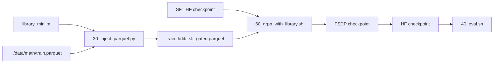

# Implementation Plan — Stage 4–7 After Stage 0

Stage 0 showed a useful negative result: retrieval can find relevant HRLib bullets, and the model usually ignores irrelevant bullets, but Qwen3-1.7B-Base still ignores most relevant bullets. The next engineering goal is therefore not better inference-time RAG; it is **cold-start SFT that teaches the policy how to read, cite, and apply library bullets**.

This document rewrites the old Stage 4–7 skeleton around that pivot. Stage 4 is the critical path. Stage 5–7 remain in scope, but they should start from the Stage 4 checkpoint if the SFT experiment is positive.

---

## §1 Current Facts From This verl Checkout

| Need | Existing asset | How to use it |
|---|---|---|
| HRLib library and retrieval | `verl/examples/hrlib/20_aggregate.py`, `30_inject_parquet.py`, `retrieve.py` | Reuse the current MiniLM score-gated retrieval path. |
| Evaluation | `verl/examples/hrlib/40_eval.sh` | Runs `verl.trainer.main_ppo` with `trainer.total_epochs=0`; change `MODEL_PATH`, `DATA_VAL`, and `OUTPUT_DIR`. |
| Bullet-use judge | `verl/examples/hrlib/judge_abstraction_use.py`, `judge_abstraction_use.sh` | Reuse for condition B vs C usage-rate comparison. |
| SFT trainer | `verl/verl/trainer/fsdp_sft_trainer.py`, `verl/verl/trainer/config/sft_trainer.yaml` | Run with `torchrun -m verl.trainer.fsdp_sft_trainer`. |
| SFT dataset format | `verl/verl/utils/dataset/multiturn_sft_dataset.py` | Use a `messages` column and set `data.multiturn.enable=true`. |
| SFT config keys | `sft_trainer.yaml` | Use `model.partial_pretrain`, `optim.lr`, `trainer.default_local_dir`; do not use `model.path`, `trainer.learning_rate`, or `trainer.save_path`. |
| Reward verification | `verl.utils.reward_score.math_reward.compute_score` | Verify teacher answers before writing final SFT data. |
| Checkpoint merge | `verl/scripts/legacy_model_merger.py`, `examples/test_time_training/merge.sh` | Merge FSDP SFT checkpoints to HF format before `40_eval.sh`. |

Important verl-specific decision: **do not pre-render SFT rows into a single `text` field**. The default single-turn `SFTDataset` wraps the prompt as a user-only message, which would lose the system/library structure. Use the multi-turn `messages` path instead.

---

## §2 Stage 4 — Cold-Start Library-Aware SFT

### Goal

Train Qwen3-1.7B-Base to follow the behavior pattern:

```text
read retrieved strategy/caution bullets -> decide which ones apply -> cite them by stable id/name -> use them in the solution
```

The key experiment is not whether SFT improves the model in general. The key experiment is whether **library-aware SFT + library at inference** beats both **base + library** and **generic SFT + library**.

### New Code Layout

Keep all new code under `verl/examples/hrlib/`, next to the existing Stage 0 workflow:

```text
verl/examples/hrlib/
├── 50_generate_sft_data.py       # teacher calls + answer verification
├── 51_prepare_sft_parquet.py     # raw JSONL -> verl multi-turn SFT parquet
├── 52_run_sft.sh                 # torchrun wrapper for library-aware and generic SFT
├── 53_merge_sft.sh               # FSDP checkpoint -> HF checkpoint
└── 54_eval_sft_conditions.sh     # conditions A-E using 40_eval.sh
```

Data and checkpoint outputs:

```text
/raid/$USER/hrlib_sft/
├── raw/
│   ├── library_aware.jsonl
│   ├── generic.jsonl
│   └── teacher_raw_dumps.jsonl
├── parquet/
│   ├── library_aware_train.parquet
│   ├── library_aware_val.parquet
│   ├── generic_train.parquet
│   └── generic_val.parquet
└── eval/
    ├── condition_A_base_no_library/
    ├── condition_B_base_library/
    ├── condition_C_sft_library/
    ├── condition_D_sft_no_library/
    └── condition_E_generic_sft_library/
```

Checkpoints:

```text
/raid/$USER/checkpoints/hrlib_sft/
├── library_aware_qwen3_1p7b/
├── generic_qwen3_1p7b/
├── library_aware_qwen3_1p7b_hf/
└── generic_qwen3_1p7b_hf/
```

### Step 4.1 Generate Teacher Solutions

Inputs:

- `~/data/math/train.parquet`
- Stage 0 labeled traces from Qwen3-1.7B-Base
- the current best library directory, e.g. `/raid/$USER/.../library_minilm`
- optional rewritten-query parquet from `25_rewrite_queries.sh`
- optional score-gated sidecar from `30_inject_parquet.py --dump_scores`

For each selected training problem:

1. Retrieve top-k bullets with the current best retrieval path (`retrieval_mode=score_gate`, `QUERY_RECIPE="[{subject}] {user_text}"`).
2. Prefer examples where the small model has a failed trace; fall back to successful traces if needed for coverage.
3. Call the teacher with problem, retrieved bullets, ground truth, and the small model trace.
4. Ask the teacher to write a correct solution that explicitly cites applicable bullets by stable tags.
5. Verify the final answer with `compute_score`.
6. Keep only verified-correct examples.

Target scale:

| Split | Library-aware | Generic control |
|---|---:|---:|
| train | 1,500–2,000 verified examples | same problem ids |
| val | 100–200 verified examples | same problem ids |

Raw record schema:

```json
{
  "problem_id": "DigitalLearningGmbH/MATH-lighteval|train|123",
  "problem": "...",
  "ground_truth": "...",
  "small_model_trace": "...",
  "small_model_score": 0.0,
  "bullets": [
    {
      "id": "strategy-000123",
      "name": "check_coprimality",
      "type": "strategy",
      "principle": "...",
      "when_to_apply": "...",
      "score": 0.73
    }
  ],
  "teacher_solution": "...",
  "verified_score": 1.0,
  "teacher_model": "deepseek/...",
  "retrieval_meta": {
    "library": "...",
    "retrieval_mode": "score_gate",
    "top_k": 6
  }
}
```

Teacher prompt requirement: the solution should cite bullets with stable tags such as `[strategy-000123: check_coprimality]`. The current Stage 0 renderer only shows `[strategy]` / `[caution]`, so the SFT data generator should render its own bullet block that includes `entry_id` and `name`.

### Step 4.2 Prepare verl Multi-Turn SFT Parquet

`51_prepare_sft_parquet.py` converts raw JSONL into parquet rows with a `messages` column:

```python
messages = [
    {"role": "system", "content": render_sft_bullets(example["bullets"])},
    {"role": "user", "content": example["problem"]},
    {"role": "assistant", "content": example["teacher_solution"]},
]
```

Write exactly this structure to parquet:

```python
{
    "messages": messages,
    "extra_info": {
        "problem_id": example["problem_id"],
        "variant": "library_aware",
        "teacher_model": example["teacher_model"],
    },
}
```

For the generic control, use the same problem ids and teacher model, but no bullet block and no bullet citations:

```python
messages = [
    {"role": "user", "content": example["problem"]},
    {"role": "assistant", "content": example["teacher_solution"]},
]
```

Do not call `tokenizer.apply_chat_template` during parquet preparation. `MultiTurnSFTDataset` applies the tokenizer chat template and masks loss to assistant messages.

### Step 4.3 Run Two SFT Jobs

Use `torchrun`, not plain `python`, for real training:

```bash
cd /home/changl9/Test-Time-Training/verl

torchrun --standalone --nnodes=1 --nproc_per_node=${NUM_GPUS:-4} \
  -m verl.trainer.fsdp_sft_trainer \
  data.train_files=/raid/$USER/hrlib_sft/parquet/library_aware_train.parquet \
  data.val_files=/raid/$USER/hrlib_sft/parquet/library_aware_val.parquet \
  data.multiturn.enable=true \
  data.multiturn.messages_key=messages \
  data.max_length=4096 \
  data.truncation=error \
  data.train_batch_size=128 \
  data.micro_batch_size_per_gpu=2 \
  model.partial_pretrain=Qwen/Qwen3-1.7B-Base \
  model.trust_remote_code=true \
  optim.lr=1e-5 \
  trainer.project_name=hrlib_sft \
  trainer.experiment_name=library_aware_qwen3_1p7b \
  trainer.default_local_dir=/raid/$USER/checkpoints/hrlib_sft/library_aware_qwen3_1p7b \
  trainer.logger=['console'] \
  trainer.total_epochs=3 \
  trainer.save_freq=100 \
  trainer.n_gpus_per_node=${NUM_GPUS:-4}
```

Run the same wrapper for `generic_train.parquet` and `generic_val.parquet` with:

```text
trainer.experiment_name=generic_qwen3_1p7b
trainer.default_local_dir=/raid/$USER/checkpoints/hrlib_sft/generic_qwen3_1p7b
```

Optional smoke test before full training:

```bash
data.train_max_samples=16 data.val_max_samples=16 trainer.total_epochs=1 trainer.save_freq=1
```

### Step 4.4 Merge SFT Checkpoints

Before evaluation, merge the selected FSDP checkpoint to HF format:

```text
/raid/$USER/checkpoints/hrlib_sft/library_aware_qwen3_1p7b_hf
/raid/$USER/checkpoints/hrlib_sft/generic_qwen3_1p7b_hf
```

`53_merge_sft.sh` should be a thin wrapper over `verl/scripts/legacy_model_merger.py`, following `examples/test_time_training/merge.sh`.

### Step 4.5 Evaluate Conditions A-E

Use MATH-500 with 32 rollouts per problem:

| ID | Model | Eval data | Purpose |
|---|---|---|---|
| A | `Qwen/Qwen3-1.7B-Base` | raw `test.parquet` | Existing vanilla baseline. |
| B | `Qwen/Qwen3-1.7B-Base` | HRLib-injected `test.parquet` | Existing Stage 0 library baseline. |
| C | library-aware SFT HF checkpoint | HRLib-injected `test.parquet` | Core hypothesis. |
| D | library-aware SFT HF checkpoint | raw `test.parquet` | Tests internalization without inference-time bullets. |
| E | generic SFT HF checkpoint | HRLib-injected `test.parquet` | Tests library-aware SFT vs generic distillation. |

Evaluation command pattern:

```bash
MODEL_PATH=/raid/$USER/checkpoints/hrlib_sft/library_aware_qwen3_1p7b_hf \
DATA_VAL=/raid/$USER/hrlib_sft/eval_data/test_hrlib_sft_gated.parquet \
OUTPUT_DIR=/raid/$USER/hrlib_sft/eval/condition_C_sft_library \
N_SAMPLES=32 \
bash examples/hrlib/40_eval.sh
```

For C and E, inject MATH-500 with the same retrieval path used in Stage 0. For D, use raw MATH-500.

After each treated run, run the judge:

```bash
EVAL_JSONL=/raid/$USER/hrlib_sft/eval/condition_C_sft_library/0.jsonl \
OUT_DIR=/raid/$USER/hrlib_sft/eval/condition_C_sft_library/judge \
bash examples/hrlib/judge_abstraction_use.sh
```

### Step 4.6 Success Criteria

Primary comparisons:

| Comparison | Claim |
|---|---|
| C > B | SFT teaches the base model to use the library. |
| C > E | Library-aware SFT beats generic teacher distillation. |
| C > D | Retrieved bullets still add value after SFT. |
| D > A | SFT internalizes some reusable behavior. |

Metrics:

- pass@1, pass@4, pass@8, pass@16, pass@32
- micro/macro rollout accuracy
- judged bullet relevance and usage
- relevant-bullet ignored rate, compared against Stage 0 condition B

Minimum viable paper result: C should clearly beat B and E, and the judge should show a large drop in ignored relevant bullets.

---

## §3 Stage 5 — Library-Augmented GRPO After SFT

Only start Stage 5 if Stage 4 condition C is positive.

### Goal

Test whether a policy that has learned to use HRLib bullets gets better RL exploration and final accuracy when GRPO rollouts include retrieved bullets.

### Default Implementation

Use preprocess-time injection, as in Stage 0:



Planned wrapper:

```text
verl/examples/hrlib/60_grpo_with_library.sh
```

It should clone the Ray-isolated pattern from `examples/test_time_training/train_intuitor.sh`, but set:

- init model to the library-aware SFT checkpoint
- `reward_model.reward_manager=naive`
- `algorithm.adv_estimator=grpo`
- `data.train_files` to the injected train parquet
- `data.val_files` to the injected MATH-500 parquet
- `data.max_prompt_length=1536` or higher, matching Stage 0 injection budget

### Comparisons

| ID | Init | GRPO train prompt | Purpose |
|---|---|---|---|
| F | base | no library | Vanilla GRPO baseline. |
| G | library-aware SFT | no library | Measures SFT-only benefit during RL. |
| H | library-aware SFT | library injected | Main Stage 5 result. |
| I | generic SFT | library injected | Checks whether library-aware SFT matters for RL. |

Expected: H > G > F, and H > I.

Do not implement rollout-time dynamic retrieval yet. Preprocess-time injection keeps Stage 5 inside existing verl data paths and avoids modifying `rl_dataset.py` or rollout code.

---

## §4 Stage 6 — Co-Evolution, Conditional

Only start Stage 6 if Stage 5 shows that library-augmented GRPO is better than the no-library GRPO controls.

### Goal

Test whether updating the library as the policy changes beats training against a static Stage 0 library.

### Driver

Planned wrapper:

```text
verl/examples/hrlib/70_coevolution_loop.sh
```

One round:

1. Merge the current policy checkpoint to HF format.
2. Use `verl.trainer.main_generation` to collect fresh MATH-train traces from the current policy.
3. Score traces with `examples/hrlib/score_traces.py`.
4. Extract new abstractions with `10_extract.py` / `10_extract_full.sh`.
5. Aggregate into `library/v{N+1}_minilm` with `20_aggregate.py`.
6. Inject train and eval parquets with `30_inject_parquet.py`.
7. Continue GRPO from the current checkpoint using `60_grpo_with_library.sh`.
8. Evaluate with `40_eval.sh` and judge bullet use.

Start with full rebuilds rather than incremental merge. `incremental_merge` can wait until the full rebuild loop is too expensive or library churn becomes hard to analyze.

### Co-Evolution Comparisons

| Condition | Library during RL | Update policy |
|---|---|---|
| Static | Stage 0 library only | never updated |
| Co-evolving | `v1 -> v2 -> v3` | update after each GRPO round or validation plateau |

Track:

- accuracy after each round
- bullet usage rate after each round
- library size and strategy/caution ratio
- fraction of retrieved bullets sourced from easy vs hard problems
- which caution clusters disappear or persist

---

## §5 Stage 7 — Extensions

Stage 7 should be treated as analysis/extensions, not part of the immediate critical path.

### 7a Weak-to-Strong

The Stage 4 pipeline is already weak-to-strong:

```text
weak model traces -> strong teacher analysis -> targeted library-aware SFT -> stronger weak model
```

Main ablation:

| Condition | Teacher input | Expected result |
|---|---|---|
| Targeted library-aware SFT | small-model failure trace + retrieved bullets | best |
| Generic distillation | problem only | weaker |
| Library without failure trace | problem + bullets only | tests value of targeted failures |

Cross-model transfer can be tested later by evaluating whether the Qwen3-1.7B-derived library helps Qwen3-4B or a stronger checkpoint.

### 7b TTRL / Intuitor + Library

TTRL and Intuitor are already prompt-agnostic reward managers:

- `verl/verl/workers/reward_manager/ttrl.py`
- `verl/verl/workers/reward_manager/intuitor.py`

Therefore the low-cost experiment is:

| Experiment | Implementation |
|---|---|
| TTRL + library | use injected parquet with `examples/test_time_training/train_ttrl.sh` / `ppo_ttrl` |
| Intuitor + library | use injected parquet with `examples/test_time_training/train_intuitor.sh` and `reward_manager=intuitor` |

Planned wrappers:

```text
verl/examples/hrlib/80_ttrl_with_library.sh
verl/examples/hrlib/82_intuitor_with_library.sh
```

Keep these after Stage 4/5 unless unsupervised RL becomes the main story.

### 7c Easy-to-Hard Analysis

Use metadata already stored in library entries:

- `source_difficulties`
- `source_problem_ids`
- `domains_seen`
- `type`
- `hit_count`

Analysis questions:

- Do hard MATH-500 problems retrieve bullets sourced from easy MATH train problems?
- Are easy-sourced bullets more likely to be general strategies?
- During Stage 5 GRPO, do successful hard-problem rollouts cite easy-sourced bullets more often?

Possible ablation:

| Library | Source |
|---|---|
| easy-only | MATH level 1–3 source problems |
| hard-only | MATH level 4–5 source problems |
| mixed | current full library |

---

## §6 Schedule

| Step | Time | Output |
|---|---:|---|
| Stage 4.1 teacher generation | 1–2 days | verified raw JSONL |
| Stage 4.2 parquet prep | 0.5 day | multi-turn SFT parquet |
| Stage 4.3 SFT jobs | 1 day | library-aware and generic checkpoints |
| Stage 4.4 merge + eval | 1–2 days | A-E result table + judge summaries |
| Stage 5 GRPO | ~2 weeks | F-I result table |
| Stage 6 co-evolution | ~2 weeks | static vs evolving curve |
| Stage 7 analyses | parallel / optional | weak-to-strong and easy-to-hard tables |

Stage 4 alone is the minimum next publishable checkpoint because it directly tests the revised thesis from `research_proposal_v2.md`: the library is a structured training signal, not merely an inference-time prompt add-on.

---

## §7 Open Decisions

- Teacher model: DeepSeek, OpenRouter model, or local strong model.
- Whether to require every teacher solution to cite at least one bullet.
- Whether to include successful small-model traces or focus only on failures.
- SFT max length: start with 4096; increase only if many verified examples are filtered.
- Whether evaluation injection should use the old Stage 0 renderer or a new SFT-style renderer with `entry_id` and `name`.
- Whether Stage 5 needs no-library rollout mixing. Default is no, until H beats G.

---

## Related Documents

- [coding_plan_v2.md](coding_plan_v2.md) — compact Stage 4 SFT plan.
- [research_proposal_v2.md](research_proposal_v2.md) — revised thesis after Stage 0.
- [implementation_plan_stage0_3.md](implementation_plan_stage0_3.md) — library construction, retrieval, injection, and inference eval.
- [README.md](README.md) — environment and test-time-training workflow.
